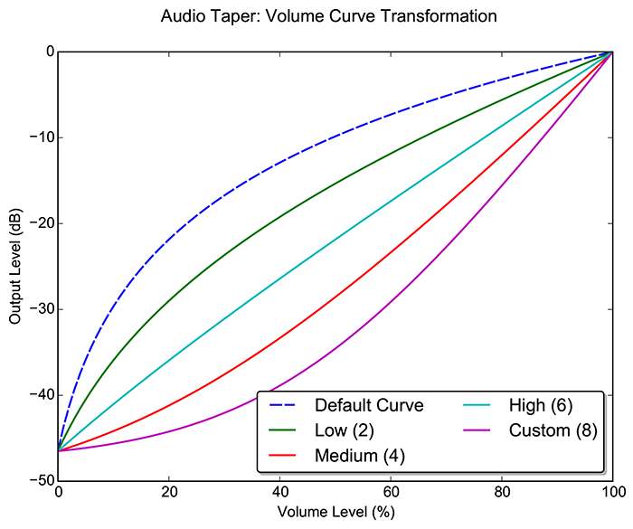

OSD Settings
============

Volume
------

Subscribe to system volume events
: Detects changes to the system volume level by other applications and displays the volume OSD when the changes occur. For example, changing the built-in Windows volume slider will cause the 3RVX OSD to display. If this is disabled, then the OSD will only be displayed when using 3RVX-based hotkeys.

Device Selector
: 3RVX normally monitors the system default audio output device, but a specific output device can be selected here.

Audio Taper Selector
: Volume is measured in decibels (dB), a logarithmic (nonlinear) scale. In other words, adding 5 dB to the system volume has a different effect on output loudness depending on the current level. To make an easy-to-understand volume slider ranging from 0 -- 100%, most operating systems apply an *audio taper* to the logarithmic volume curve to make it behave more like a linear scale; adding 5% to the volume level should increase the output loudness by roughly the same amount. 

Volume Limiter
: This option prevents 3RVX from raising the volume past a specified limit. Note that when this option is applied, the limit becomes the new "100%" volume level as reported by 3RVX.

Force volume limit
: Forcing a volume limit prevents changes that occur outside 3RVX (other applications, the system volume slider, etc). This is achieved by detecting changes above the limit and resetting the volume level.

Mute volume during session lock
: When enabled, 3RVX will mute the volume when the current session is locked (accessed from the start menu or by pressing Win+L).
