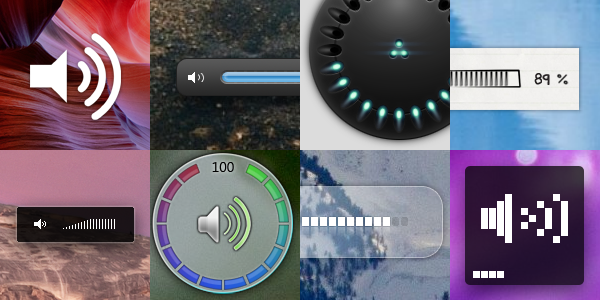

3RVX
====

One thing Windows always lacked was an on-screen display (OSD) for multimedia events like the volume changing or a drive being ejected. While the latest versions of Windows do have a built-in OSD, it is relatively simple. That's where 3RVX comes in: it's a highly customizable service that provides an on-screen display, hotkey controls, tray notifications, and more. Here's a look at some of the 'skins' that completely change the volume OSD's look and feel:

Version 3
---------

A new version of 3RVX is currently in development. New features include:

* A complete overhaul and open source rewrite in C++ (more responsive, lower memory usage)
* Several new OSD meter types and improved tray slider functionality
* Auto-detection of device changes and selectable control over volume device

Download Beta 8: 
* [releases/3RVX-3.0-B8.msi](3RVX 3.0 Beta 8)
* [releases/3RVX-3.0-B8.zip](3RVX 3.0 Beta 8 (Portable))

Be warned, this version is buggy! You can submit bug reports on [Github](https://github.com/malensek/3RVX).

Version 2
---------
The older version, 2.5, is still available here: [3RVX 2.5](releases/3RVX_2.5.msi).
